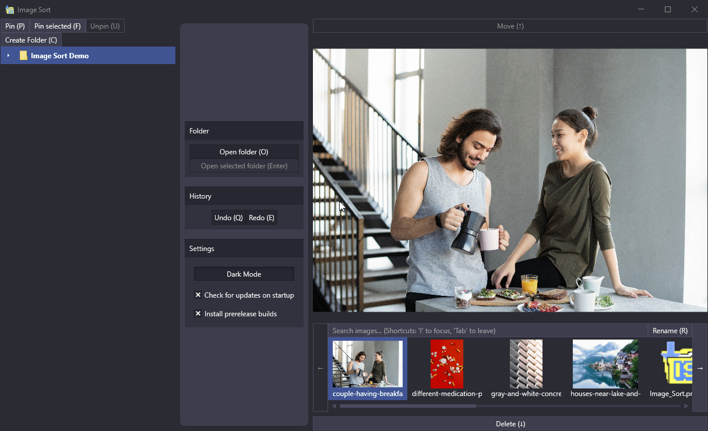

# Image Sort 
Sorts your image at high speed

## How to use

> The central philosophy behind Image Sort's design is speed. For that reason the ideal way to use this app is not to
leave the keyboard. However, you can of course use the app in any way you wish and ideally it should still help you 
sort your images fast.

When you open the app, you are presented with your pictures folder already being open. When you want to open another
folder, open it by pressing the "Open folder" button or the 'O' key.

### Central workflow

On the left you have your folders. It's a tree, so you can access all your sub-folders. You can also pin folders,
either the selected one ("Pin selected") or a manually picked one  ("Pin"), making them easier to access, but also
making it possible to f.e. sort images from one folder into others, possibly on other drives entirely. So you could for example pin your pictures folder and open the camera, that you connected to the PC, and start sorting the images from the camera straight into the pictures folder. 

Then, once you have opened a folder, select an image and choose whether you want to move the image to the selected folder or want to delete it (moving it to the recycle bin).

But maybe you accidentally delete or move an image and think 'Oh, why did I do that? Can I undo this?'. Yes, you can.
Simply press undo. You would not believe how much of a pain this is to achieve for the recycle bin. But it was worth it,
I hope.

### The keyboard is your friend

Why not up you sorting game? Learn the keyboard shortcuts and really speed up your work! They are really simple and don't take a lot of time to learn. Image Sort is optimized to allow for elegant keyboard-only-no-mouse-needed™©® usage!

However, how you should place your hands on your keyboard is not immediatly obvious. But once you get the hang of it (estimated time necessary: 5-20 seconds), it should feel completely natural!

You navigate through the folders on the left by using the WASD keys. Gamers™ already now this control scheme, but to anyone else,
they basically work like the arrow keys, with W being up, A being left, S being down and D being right. So you use WASD
like you do the arrow keys but with your left hand. Ideally you want to put the middle finger on the W/S keys, the
ring finger on the A and the index finger on the D key.

Meanwhile, the actual arrow keys are in use by your right hand. The left and right keys navigate through the images.
The up arrow key moves the current image to the selected folder and the down arrow key deletes the image (or rather moves it to the recycle bin).

Often used actions are close to these two key-groups, while less often used actions may be more distanced.

For example, the keybindings for Undo/Redo are Q and E respectively, because the are easily accessible from your ring/index fingers. Q is undo, E is redo. What this allows you is to do these actions without a lot of friction, hopefully
allowing you to sort your images really quickly without annoying pauses or slowdowns because you have to change from
the keyboard to the mouse or the other way around.

On the other hand, actions like "Open folder" are usually not that often used, so they're bound to less close and often more expressive shortcut (like 'O', for the aforementioned "Open folder" action).

In general, you should learn this basic position, but aside from that only learn the shortcuts you really need. It can
be nice to select a new folder with 'O' but if you do that once a day and do not see value in learning that particular
shortcut for just that few uses, just ignore it. It doesn't hurt to move your hands off your keyboard every once in a
while. Do not feel pressured into doing everything with the keyboard just because someone told you how great that is!
It's your choice to see what works out best for you!

## Privacy Policy
Read the [Privacy Policy](https://imagesort.org/privacy_policy.html) page for details on what data we collect. 

(This is necessary for the Windows Store version. Right now, no data is willingly collected. However, the auto-updater uses GitHub services, so to facilitate the services some data could be collected by GitHub. Turn off "Check for updates on startup" if you do not want this to happen. You can read their [privacy policy here](https://help.github.com/en/github/site-policy/github-privacy-statement).)

## Requirements
* Windows 7 Service Pack 1 or higher

## Build-Prerequisites
* [.NET 5 SDK](https://dotnet.microsoft.com/download/dotnet/5.0)
* (optional) Visual Studio 2019 Version 16.8 or higher
* (optional) For building the installer, you need [WiX Toolset](https://wixtoolset.org/) 3.11 or higher
