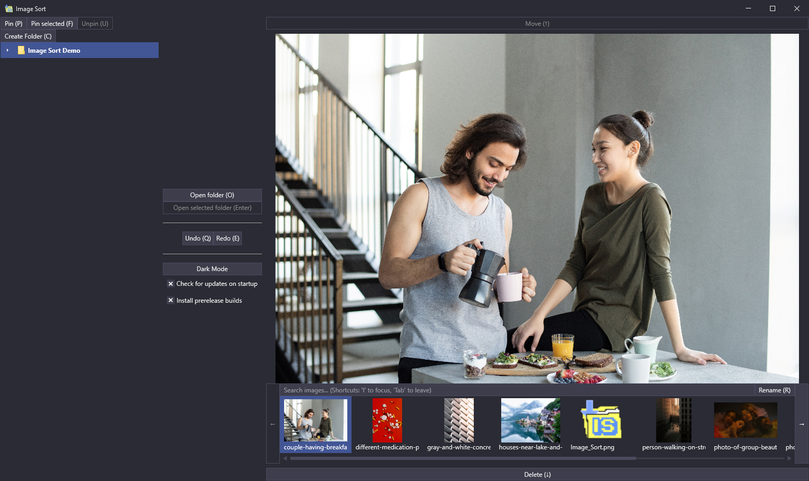

# Image-Sort 
Sorts your image at high speed

## How to use

> The central philosophy behind Image Sort's design is speed. For that reason the ideal way to use this app is not to
leave the keyboard. However, you can of course use the app in any way you wish and ideally it should still help you.

When you open the app, you are presented with your pictures folder already being open. When you want to open another
folder, open it by pressing the "Open folder" button or the 'O' key.

### Central workflow

On the left you have your folders. It's a tree, so you can access all your sub-folders. You can also pin folders,
either the selected one ("Pin selected") or a manually picked one  ("Pin"), making them easier to access, but also
making it possible to f.e. sort images from one folder into others on other disks.

Then, select an image and choose whether you want to move the image to the selected folder or want to delete (move
to recycle bin) it.

But maybe you accidentally delete or move an image and think 'Oh, why did I do that? Can I undo this?'. Yes, you can.
Simply press undo. You would not believe how much of a pain this is to achieve for the recycle bin. But it was worth it.

2. If you want to you can use the keyboard alone for all the tasks:
   #### The important stuff
   * F2 for selecting the folder
   * F3 to create a new folder
   * F5 to open the currently selected image in the explorer
   * Enter to enter the currently selected folder
   * Escape to leave the current folder
   * up- and down-arrow-keys to select a folder to move to
   * right-arrow-key to move the image into the selected folder (or one folder upwards if you select "..")
   * left-arrow-key to skip it
   * ctlr + left-arrow-key to revert the last action done (move/skip)
   * ctrl+s toggles the search bar, allowing for quick searches for the folder you need. Close hide the search bar again to resume using the arrow keys to sort images. You can also achieve this by pressing the "Search" button.
   #### The not-so-important stuff
   * F4 to change the resolution in which the images should get loaded (default: 1000 pixel, smaller = less RAM usage and faster loading speed). Pressing F4 will move your focus to the text box, so that you can type in your preferred resolution. Pressing Enter or Escape, as well as moving the focus away restores normal keyboard input behavior.
   
## Privacy Policy
Read the [Privacy Policy](https://imagesort.org/privacy_policy.html) page for details on what data we collect. 

(This is necessary for the Windows Store version. Right now, no data is willingly collected. However, the 
auto-updater uses GitHub services, so to facilitate the services some data can be collected. Turn off "Check for updates on startup"
if you do not want this to happen.)

## Requirements
* Windows 7 Service Pack 1 or higher

## Build-Prerequisites
* [.NET Core SDK 3.1](https://dotnet.microsoft.com/download/dotnet-core/3.1)
* (optional) Visual Studio 2019
* (optional) For building the installer, you need [WiX Toolset](https://wixtoolset.org/) 3.11 or higher
